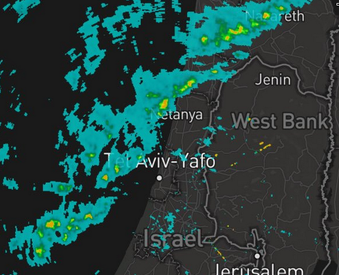

Recently I've built an interesting little website that was very useful for me, and as it turns out, for others as well. Inspired by the real-time weather app DarkSky, I set out to build a similar service for the local weather data in Israel. The national meterological service provides a very crude looking radar that shows the current rain cloud coverage. Their website usability is poor, and don't even think about trying to use it on a mobile device. In addition, on rainy days their service collapses under the load.

The service that I built, [https://geshem.space](https://geshem.space) (rain, in Hebrew) was designed to do two things:

1. Mirror the radar imagery to make sure it's always available
2. Overlay the images them on a modern and responsive user interface based on a Mapbox's awesome new GL maps

Initially the service was implemented in Python running on Flask with the UI based on React and deployed on Heroku, and it worked reasonably well. This year I decided to re-implement everything and make it all a bit more stable due to some loose ends that were remaining.

An initial rewrite was done for all the components, the server was rewritten on Express and the UI in Vue.js, which is now my preferred reactive UI framework. However, since I was still deploying using Heroku's free dynos, I was still having stability problems with the periodic task that was fetching the images, and I got fed up with the entire setup, so I decided on a completely new architecture that I found rather interesting.

This architecture is based on two main concepts:

1. Serve the entire service from static storage
2. Update the static storage periodically using a serverless setup

A static website is ridiculously easy to serve, and there's simply no good reason to maintain a live web server just for such a service. Let's go into some of the details of each component.

## Periodic Task

This is the first time I decided to go with a serverless setup. I don't believe in lots of the serverless hype going on, but if I need a simple task running once a minute, there might actually be cost-saving potential in setting it up on AWS Lambda.

The task I run is pretty simple, once a minute I fetch an upstream JSON file that points to a set of 20 PNG images, roughly two new images are generated every 10 minutes. Each of those images is saved in the S3 bucket, and of course there's no need to fetch old images that have already been mirrored.

Once the images have been fetched, a new JSON index file pointing to the latest images is generated according to a scheme that better matches the frontend I built, and uploaded to S3 as well.

The update function is implemented in Python 3.6 and has only one external dependency - `urllib3`. `boto3` is also a requirement but is already bundled in the AWS Lambda Python SDK. The total memory usage of the function is no higher than `40MB`, allowing to use the cheapest possible tier of lambda functions at `128MB` RAM. I did a rough calculation that running this function once every minute, with an average run taking 5 seconds will cost at the of the month: `5 sec * 60 minutes * 750 hours * $0.00000208 per second = ~$0.468` - half a dollar a month for the entire thing.

For managing the entire thing I used [serverless](https://serverless.com/) which really is a great toolkit for managing the infrastructure around the lambda function: enabling IAM permissions on the relevant S3 buckets, setting up the CloudWatch cron job, and deploying and invoking the function for testing.

## Front-end Components

The front-end was built in Vue.js just to keep everything nice and reactive, but really there isn't much going on. The main component is a full-window Mapbox GL JS map, with the radar images overlayed on top of it as transparent raster layers. Re

Webpack is used to build the entire JS bundle.

There's a basic HTML page that loads the JS bundle and has placeholders for the main components. All of those are thrown onto a separate S3 bucket that jsut serves the static content: index page, JS bundle, and some icon images.

Deploying the static assets to S3 is as simple as running `aws s3 sync`.

## CDN

Finally, the entire application is delivered via Cloudflare as the CDN, it points to the two S3 buckets: `geshem.space` for the main static assets, and `imgs.geshem.space` for the radar images, and the JSON index file. Proper cache headers are set to ensure that the radar images are essentially cached forever, and the index JSON is cached for 1 minute until the next run occurs. Static assets are cached for a few hours.

Needless to say, using Cloudflare for such a simple service is  free of cost.

## Conclusion

Despite not being too fond of vendor lock-in or of hype around being "serverless", this entire architecture makes a lot of sense to me. Simplifying the application down to static delivery makes everything very simple to handle, highly performant, infinitely scalable, and with no long-term dependence on any specific vendor. If I want to move off of AWS, or switch CDN provider, I just take my simple Python function and throw it elsewhere, together with all of the mirrored static files.

As always, the complete source code can be found on Github at [https://github.com/yuvadm/geshem.space](https://github.com/yuvadm/geshem.space)