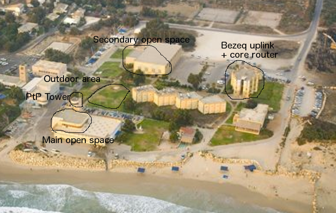
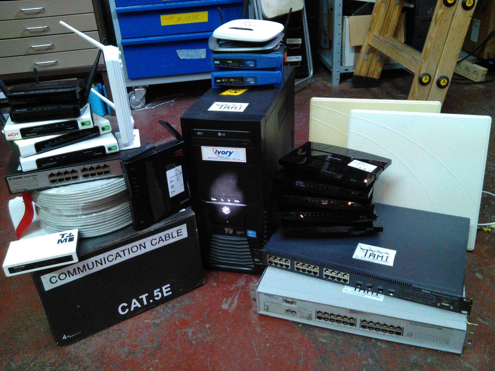

*This post is actually published one year late, as the draft has already been written shortly after [GeekconX](http://www.geekcon.org/) in 2014. This year we deployed the same network with some slight changes, but the core of the setup remained the same. Here's what we did.*

Our mission was to setup a reliable internet connection for ~120 hackers and makers for the entire duration of Geekcon which was 3 days. This meant supporting up to 300 wire/less devices at peak usage. There were a few requirements that didn't make our job easy at all:

 - the ADSL uplink provider could only set up a point at the administrative building that was 100-150 meters away from where Geekcon actually took place
 - the main hacking area is a very dense space that at peak will hold ~100 people at the same time
 - we also had to cover the outdoor area as well as the sports hall for the final presentations
 - we didn't have any professional networking equipment to deploy

Our only choice was to use off-the-shelf equipment and open-source stacks - this wasn't a limitation, the entire team preferred to use an open-source stack so that similar setups could be implemented easily in other venues. This meant using only routers we could find at stores and using everything we had sitting around that we could lay our hands on. This usually meant TP-Link devices which are high quality yet cheap, and have excellent [OpenWrt](http://openwrt.org/) support, which was naturally flashed on all the devices.

The network setup begins at the administrative building where we have 2 ADSL uplinks, each capable of handling no more than 30/3 Mbps, we took two for redundancy and load balancing. The core router was placed right next to the ADSL modems. From there, we pulled up a point-to-point link from the building rooftop to the building where the open space was located, initially we planned to mount the antenna on the building tower, but settled for the balcony corner closest to the first building since we had a good enough line-of-sight there, and it was easier to access. From the PtP antenna we hooked up a beefy switch and connected all our endpoint APs to there, including anyone who wanted to use an ethernet connection. The outdoor area was also covered by the same APs. Finally, the sports hall was poorly covered, since we didn't have another PtP antenna pair, so we had to use a pair of bridged APs, one acting as a station of the outdoor area APs, and the other providing an access point inside the building. This wasn't too bad since no one actually ended up using that space.

## Core Router

Since our architecture was based around a smart edge router with many stupid APs beneath it, we decided to build a core router around a beefy x86_64 PC we had sitting around the hackerspace and installed [pfSense](https://www.pfsense.org/) on it, which is an awesome OpenBSD distribution that is built to power large-scale routers and firewalls. We threw in 3 PCIe gigabit ethernet adapters: one for each uplink modem and the third for the downstream PtP link. pfSense is super easy to configure, and we actually got lots of neat stuff for free such as monitoring and management tools, as well as an intrusion detection system, which came in handy later on. The core router was basically doing all the important network services: NAT, firewall, DHCP and DNS - leaving nothing to the perpheral routers other than to bridge all the connections together and make sure end clients have a quick route to our core router.

## Point-to-point Link

For the PtP link we used two of our best routers, the TP-Link TL-WDR4300 (running OpenWrt), each connected to a D-Link dual-band directional antenna. For simplicity's sake we opted to use a single 5GHz band bridged wireless connection giving us 450Mbps of effective bandwidth with the built-in MIMO setup. Mounting the antennas was the trickiest part since the routers aren't proper outdoor routers and aren't POE-capable, meaning we need to pull not only CAT5 cables up to the roof, but power cables as well. This is by far simplified by using proper outdoor equipment and injecting your power over-ethernet. From the network perspective, the PtP link is nothing more than a stupid bridged link that repeats anything it gets from ethernet to wireless and vice versa.

## Access Points

The access points are the most boring aspect of the deployment, they are all just 'stupid' bridged APs bridging the LAN ports and the wireless interfaces. Since we had one core router doing all the hard work, all peripheral services had to be disabled on all the APs (DHCP and DNS, essentially).

The most challenging aspect is frequency management, and setting your frequencies properly such that no two adjacent APs are transmitting on the same channels, and get as little overlap as possible between all the channels so you don't create too much noise for the other APs. This means we used channels 1, 6 and 11 on the 2.4Ghz band, and channels 40, 44 and 48 on the 5Ghz band. Since channel 36 was used on the PtP connection, due to close proximity, it wasn't used at all by the APs.

We only used off-the-shelf devices naturally all running OpenWrt. The trusty TL-WDR4300 were the core of the setup since they have nice beefy specs and dual-band radios, and we also threw in some other smaller TP-Link devices to cover the outdoor areas. Managing the APs was done by trial and error, and it took a few re-arrangements before we found out where we need to locate our APs such that they are more or less balanced in the open space. We didn't get to it, but when it starts to get noisy, it's highly advised to reduce your TX power and use more APs to make sure you're making the best use of the EM spectrum without hitting physical limits.

## IP address space

The address space was pretty easy to divide up. The entire LAN was operating on the `10.14.0.0/16` subnet. Since using a single /24 wasn't enough, we had plenty of room to play around with addressing:

 - `10.14.1.1` was our core router
 - `10.14.2.1` and `10.14.2.2` were the two PtP devices
 - `10.14.3.{1..N}` were the endpoint APs
 - Finally, DHCP addresses were allocated in the `10.14.{4,5,6,7}.0` range, plenty to go around.

## Gotchas

 1. We were lucky to have mostly nice weather, but did get one night of rain, which almost ruined all of our outdoor installations. If you don't use proper outdoor gear, at the very least make sure it's weather-proof. POE gear is highly recommended to simplify rooftop installations.
 2. Learn how to properly crimp your CAT5/6 cables! It's pretty embarrasing to get a faulty connection just because you did a lousy job crimping your connectors.
 3. Make sure to hang your APs as high as possible, people are excellent absorbers of electromagnetic fields.
 4. On the second day, some security research n00bs were up to no good and started flooding our network with packets of crap, practically killing our DHCP server. Only after some downtime we managed to kick them off and get [snort](https://snort.org/) running. Make sure you get it running preemptively, before the trouble starts.

## Photos

Check out more photos of the entire setup at [https://imgur.com/a/rgDuF](https://imgur.com/a/rgDuF) and [https://imgur.com/a/gcXmu](https://imgur.com/a/gcXmu).